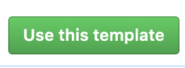
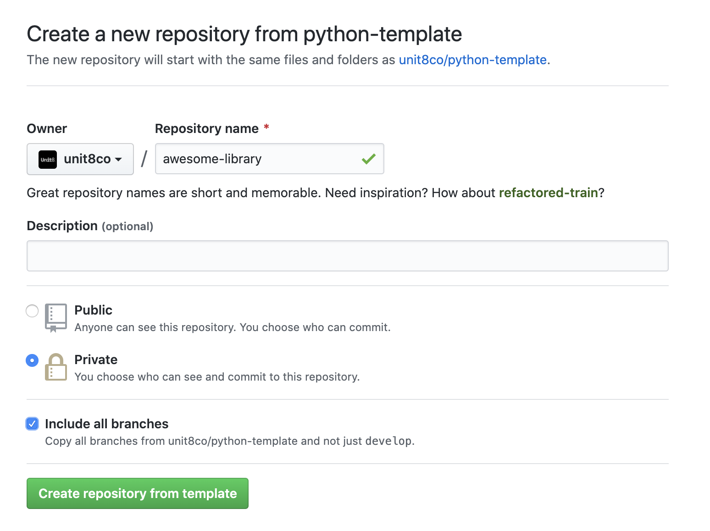

# python-template

This is a Unit8 template library which can offload you from setting up a common boilerplate. Additionally it can suggest
common style across many application which will help new comers to quickly adopt our style and be efficient.

## How to use it?

When you would like to setup a new python library please follow those steps.a

* Click on `Use this template`

* Fill out required fields

**Please remember to select `Include all branches`.**

* Work on your project and delete and unused code.

## [Development](/DEVELOPMENT.md)

## [Release process](/RELEASE.md)

## What is inside?

We want to keep this template as small as we can, while showing useful tools and conventions.

Currently template includes:

* Examples of `setup.py`
* Examples of modules and subpackages
* Example of Github branch schema and protection rules (look at settings of template repository)
* Generates API reference
* Generates documentation
* Automatic workflow for development and release
